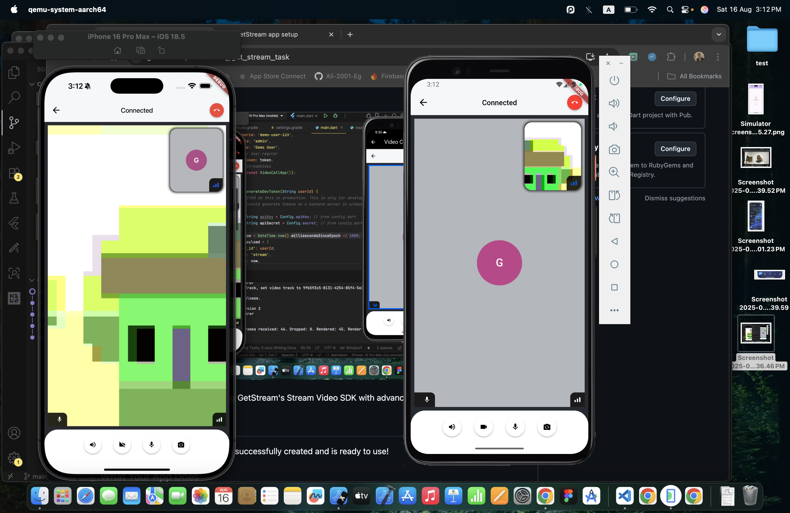

# GetStream Video Call App



A Flutter video calling application using GetStream's Stream Video SDK with advanced features.

## 🚀 Project Overview

This Flutter video calling app has been successfully created and is ready to use!

### 📱 What Your App Does

*   **Welcome Screen**: Beautiful UI with name input and auto-generated user ID.
*   **User Experience**: Enter your name, get a random user ID, and join the call.
*   **Video Call Screen**: Shows your user info and call controls.
*   **End Call**: Functional end call button.
*   **Modern Design**: Material Design 3 with a blue theme.

### 🔧 Technical Stack

*   **Flutter 3.35.1** with FVM
*   **Dart 3.9.0**
*   **Android Gradle Plugin 8.6.0**
*   **Gradle 8.7**
*   **Kotlin 2.1.0**
*   **compileSdk 36**
*   **GetStream API Key**: `9zdzan233dwe` (configured for testing)

## Features Implemented


1. **Enhanced UI/UX** - Beautiful and user-friendly interface
2. **Call State Management** - Prevents multiple join attempts
3. **No App Bar** - Clean interface without app bars as requested

## Getting Started

### Prerequisites

- Flutter SDK
- GetStream Account with API Key and Secret

### Installation

1. Clone the repository
2. Run `fvm flutter pub get` to install dependencies
3. Update `lib/config.dart` with your GetStream credentials
4. Run the app with `fvm flutter run`

### Configuration

Update the `lib/config.dart` file with your GetStream credentials:

```dart
class Config {
  static const String apiKey = 'your_api_key_here';
  static const String roomId = 'test-room';
  static const String secret = 'your_secret_here';
}
```

## Features

###  Bottom Actions

The bottom action bar has been redesigned to be more user-friendly with:
- Camera toggle
- Microphone toggle
- End call button
- Speaker toggle

### Call State Management

The app prevents multiple join attempts by:
1. Checking the BLoC state before joining
2. Showing appropriate messages when already in a call

## Architecture

The app uses:
- **Stream Video SDK** for video calling features

## Dependencies

- stream_video_flutter: ^0.10.2
- stream_video: ^0.10.2
- dart_jsonwebtoken: ^3.2.0

## Contributing

1. Fork the repository
2. Create your feature branch
3. Commit your changes
4. Push to the branch
5. Open a pull request

## License

This project is licensed under the MIT License.
# get_stream_task
